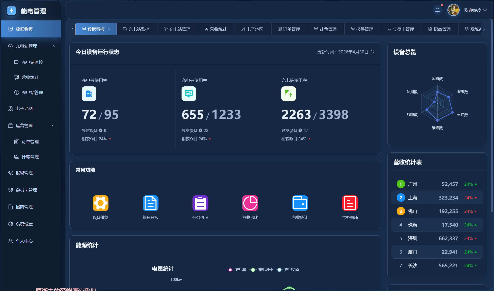

#### 项目介绍：基于Vue3+TypeScript的企业级管理后台系统，围绕报警管理、权限配置、文档发布等核心场景实现了高可维护的模块化开发与大数据列表性能优化。

#### 技术栈:Vue3、VueRouter、Pinia、Vite、TypeScript、Element plus、Axios、Echarts、Mock.js

#### 项目截图：

1.登录界面：

2.数据看板：

3.充电站监控

4.充电站管理

5.电子地图

6.招商管理

7.系统设置（权限设置）

8.个人中心

